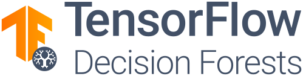

<p align="center">

</p>

> **Note:** We recommend users to migrate to **Yggdrasil Decision Forests**
> (**YDF**). YDF trains the same models as TF-DF, but is faster and has more
> functionality. See the
> [migration guide](https://ydf.readthedocs.io/en/latest/tutorial/migrating_to_ydf/)
> for more information.

**TensorFlow Decision Forests** (**TF-DF**) is a library to train, run and
interpret [decision forest](https://ydf.readthedocs.io/en/latest/intro_df.html)
models (e.g., Random Forests, Gradient Boosted Trees) in TensorFlow. TF-DF
supports classification, regression and ranking.

**TF-DF** is powered by
[Yggdrasil Decision Forest](https://github.com/google/yggdrasil-decision-forests)
(**YDF**, a library to train and use decision forests in C++, JavaScript, CLI,
and Go. TF-DF models are
[compatible](https://ydf.readthedocs.io/en/latest/convert_model.html#convert-a-a-tensorflow-decision-forests-model-to-a-yggdrasil-model)
with YDF' models, and vice versa.

Tensorflow Decision Forests is available on Linux and Mac. Windows users can use
the library through WSL+Linux.

## Usage example

A minimal end-to-end run looks as follows:

```python
import tensorflow_decision_forests as tfdf
import pandas as pd

# Load the dataset in a Pandas dataframe.
train_df = pd.read_csv("project/train.csv")
test_df = pd.read_csv("project/test.csv")

# Convert the dataset into a TensorFlow dataset.
train_ds = tfdf.keras.pd_dataframe_to_tf_dataset(train_df, label="my_label")
test_ds = tfdf.keras.pd_dataframe_to_tf_dataset(test_df, label="my_label")

# Train the model
model = tfdf.keras.RandomForestModel()
model.fit(train_ds)

# Look at the model.
model.summary()

# Evaluate the model.
model.evaluate(test_ds)

# Export to a TensorFlow SavedModel.
# Note: the model is compatible with Yggdrasil Decision Forests.
model.save("project/model")
```

## Google I/O Presentation

<div align="center">
    <a href="https://youtu.be/5qgk9QJ4rdQ">
        </img>
    </a>
</div>

## Documentation & Resources

The following resources are available:

-   [TF-DF on TensorFlow.org](https://tensorflow.org/decision_forests) (API
    Reference, Guides and Tutorials)
-   [Tutorials](https://www.tensorflow.org/decision_forests/tutorials) (on
    tensorflow.org)
-   [YDF documentation](https://ydf.readthedocs.io) (also applicable to TF-DF)
-   [Issue tracker](https://github.com/tensorflow/decision-forests/issues)
-   [Known issues](documentation/known_issues.md)
-   [Changelog](CHANGELOG.md)
-   [More examples](documentation/more_examples.md)

## Installation

To install TensorFlow Decision Forests, run:

```shell
pip3 install tensorflow_decision_forests --upgrade
```

See the [installation](documentation/installation.md) page for more details,
troubleshooting and alternative installation solutions.

## Contributing

Contributions to TensorFlow Decision Forests and Yggdrasil Decision Forests are
welcome. If you want to contribute, make sure to review the
[developer manual](documentation/developer_manual.md) and
[contribution guidelines](CONTRIBUTING.md).

## Citation

If you us Tensorflow Decision Forests in a scientific publication, please cite
the following paper:
[Yggdrasil Decision Forests: A Fast and Extensible Decision Forests Library](https://doi.org/10.1145/3580305.3599933).

**Bibtex**

```
@inproceedings{GBBSP23,
  author       = {Mathieu Guillame{-}Bert and
                  Sebastian Bruch and
                  Richard Stotz and
                  Jan Pfeifer},
  title        = {Yggdrasil Decision Forests: {A} Fast and Extensible Decision Forests
                  Library},
  booktitle    = {Proceedings of the 29th {ACM} {SIGKDD} Conference on Knowledge Discovery
                  and Data Mining, {KDD} 2023, Long Beach, CA, USA, August 6-10, 2023},
  pages        = {4068--4077},
  year         = {2023},
  url          = {https://doi.org/10.1145/3580305.3599933},
  doi          = {10.1145/3580305.3599933},
}
```

**Raw**

Yggdrasil Decision Forests: A Fast and Extensible Decision Forests Library,
Guillame-Bert et al., KDD 2023: 4068-4077. doi:10.1145/3580305.3599933

## Contact

You can contact the core development team at
[decision-forests-contact@google.com](mailto:decision-forests-contact@google.com).

## Credits

TensorFlow Decision Forests was developed by:

-   Mathieu Guillame-Bert (gbm AT google DOT com)
-   Jan Pfeifer (janpf AT google DOT com)
-   Richard Stotz (richardstotz AT google DOT com)
-   Sebastian Bruch (sebastian AT bruch DOT io)
-   Arvind Srinivasan (arvnd AT google DOT com)

## License

[Apache License 2.0](LICENSE)
